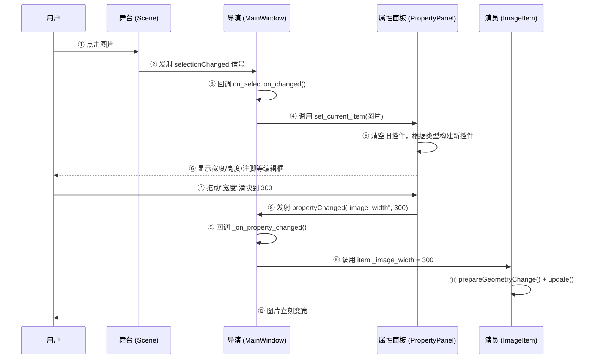
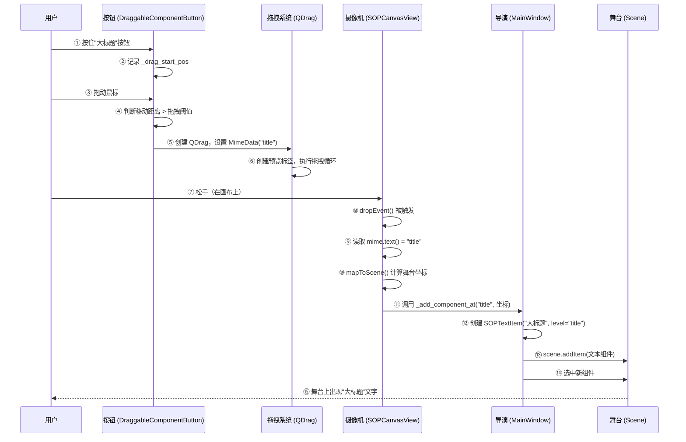
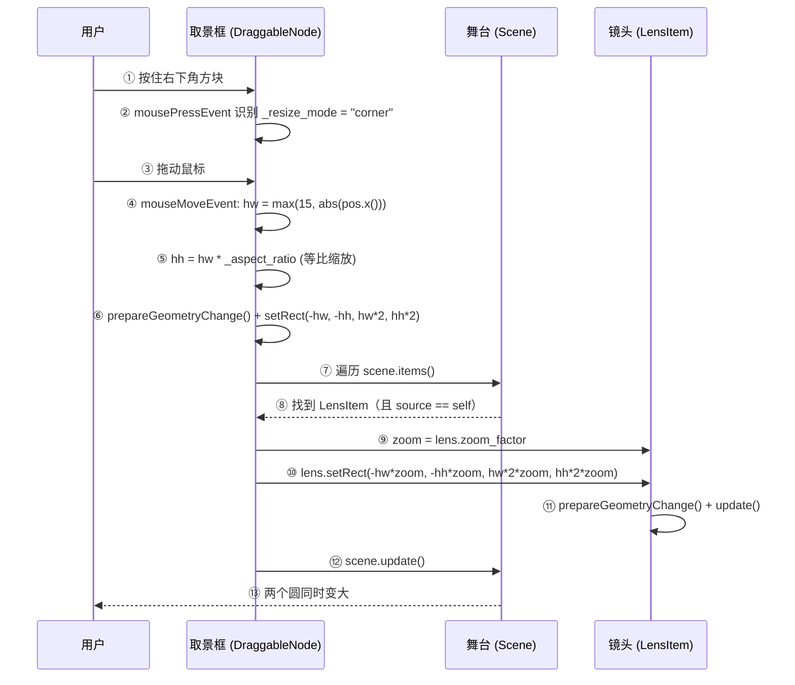

# 🏗️ SOP Forge 全景架构与源码导读

> **写给项目主理人的一封信**  
> 你好！这份文档将带你像参观一座剧院一样，彻底理解 SOP Forge 的每一块砖瓦。  
> 我们使用一个贯穿全文的比喻：**Scene 是舞台，Item 是演员，View 是摄像机镜头，MainWindow 是导演**。  
> 准备好了吗？帷幕拉开——

---

## 1. 📂 模块化目录树与文件速查

```
sop-forge/
├── main.py                          # 🎬 入口：搭建舞台、点亮灯光、启动演出
├── requirements.txt                 # 依赖清单
├── test_samples.pdf                 # 测试导出样本
├── test_samples.sop.json            # 测试存档样本
│
├── src/
│   ├── __init__.py                  # 包标记
│   │
│   ├── main_window.py               # 🎥 导演：组装所有面板、菜单、工具栏、信号连线
│   ├── scene.py                     # 🏟️ 舞台：管理多页 A4 连排、网格、安全边距、磁吸对齐
│   ├── view.py                      # 📹 摄像机：处理缩放、平移、右键菜单、拖拽放图片
│   ├── theme.py                     # 🎨 化妆师：全局多巴胺 QSS 样式表
│   │
│   ├── items/                       # 🎭 演员休息室（所有可拖拽的图形组件）
│   │   ├── __init__.py
│   │   ├── base_item.py             # 🧬 基因注入器：SmartGraphicItemMixin（可移动、可选、磁吸、冻结）
│   │   ├── text_item.py             # 📝 文本演员：大标题/正文/注脚 + Emoji 自动补全
│   │   ├── image_item.py            # 🖼️ 图片演员：加载/缩放/注脚
│   │   ├── icon_item.py             # 🔣 图标演员：8 种预设图标 + 8 种多巴胺配色
│   │   ├── highlight_item.py        # □ 框选演员：高亮矩形 + 虚线/实线切换
│   │   ├── arrow_item.py            # → 箭头演员：可拖拽箭头尖/箭尾调整角度和长度
│   │   ├── magnifier.py             # 🔍 放大镜三人组：取景框(DraggableNode) + 镜头(LensItem) + 光锥(MagnifierConeItem)
│   │   └── group_item.py            # 🔗 组合演员：PPT 式点击穿透组合
│   │
│   ├── panels/                      # 📺 后台控制室（所有侧边面板）
│   │   ├── __init__.py
│   │   ├── component_panel.py       # 🧩 工具箱面板：可拖拽的组件按钮
│   │   ├── property_panel.py        # 📐 属性面板：选中组件后显示可编辑属性
│   │   └── emoji_panel.py           # 😀 Emoji 词典面板：关键词→Emoji 自动映射
│   │
│   └── io/                          # 💾 存档室（文件读写）
│       ├── __init__.py
│       ├── serialization.py         # 💿 存档/读档：JSON 序列化与反序列化
│       └── pdf_export.py            # 📄 PDF 导出：逐页渲染 + 放大镜预缓存
```

---

## 2. 🧩 核心类图与继承关系

下面这张图展示了所有"演员"的血缘关系。关键看 **SmartGraphicItemMixin**——它就像一管"基因注射液"，注入到每个组件中，让它们瞬间获得"可移动、可选中、可磁吸、可冻结"的超能力。

```mermaid
classDiagram
    class SmartGraphicItemMixin {
        +is_frozen() bool
        +itemChange(change, value)
        # setFlags(ItemIsMovable | ItemIsSelectable | ItemSendsGeometryChanges)
    }

    class QGraphicsEllipseItem {
        <<Qt Native>>
    }
    class QGraphicsRectItem {
        <<Qt Native>>
    }
    class QGraphicsTextItem {
        <<Qt Native>>
    }
    class QGraphicsItemGroup {
        <<Qt Native>>
    }
    class QGraphicsItem {
        <<Qt Native>>
    }

    SmartGraphicItemMixin <|-- DraggableNode
    SmartGraphicItemMixin <|-- LensItem
    SmartGraphicItemMixin <|-- HighlightItem
    SmartGraphicItemMixin <|-- SOPTextItem
    SmartGraphicItemMixin <|-- ImageItem
    SmartGraphicItemMixin <|-- IconItem
    SmartGraphicItemMixin <|-- ArrowItem
    SmartGraphicItemMixin <|-- SOPGroupItem

    QGraphicsEllipseItem <|-- DraggableNode
    QGraphicsEllipseItem <|-- LensItem
    QGraphicsRectItem    <|-- HighlightItem
    QGraphicsTextItem    <|-- SOPTextItem
    QGraphicsItem        <|-- ImageItem
    QGraphicsItem        <|-- IconItem
    QGraphicsItem        <|-- ArrowItem
    QGraphicsItemGroup   <|-- SOPGroupItem
    QGraphicsItem        <|-- MagnifierConeItem

    class DraggableNode {
        +boundingRect() QRectF
        +shape() QPainterPath
        +mouseMoveEvent(event)
        +paint(painter, option, widget)
    }
    class LensItem {
        +boundingRect() QRectF
        +shape() QPainterPath
        +mouseMoveEvent(event)
        +paint(painter, option, widget)
        +prepare_export_cache()
    }
    class HighlightItem {
        +mouseMoveEvent(event)
        +paint(painter, option, widget)
    }
    class SOPTextItem {
        +set_level(level)
        +mouseDoubleClickEvent(event)
        +_on_text_changed()
    }
    class ImageItem {
        +mouseMoveEvent(event)
        +paint(painter, option, widget)
    }
    class IconItem {
        +paint(painter, option, widget)
    }
    class ArrowItem {
        +mouseMoveEvent(event)
        +paint(painter, option, widget)
    }
    class SOPGroupItem {
        +mousePressEvent(event)
        +to_dict() dict
        +from_dict(data, scene) SOPGroupItem
    }
    class MagnifierConeItem {
        +boundingRect() QRectF
        +paint(painter, option, widget)
    }
```



**关键洞察**：`SmartGraphicItemMixin` 使用 Python 的**多重继承（Mixin 模式）**，像"基因编辑"一样注入到每个组件中。它做了三件核心事：

1. **构造函数中设置 Flags**：`ItemIsMovable | ItemIsSelectable | ItemSendsGeometryChanges`——让每个组件天生就能被拖拽、被选中、能感知位置变化。
2. **`itemChange` 钩子**：当组件位置变化时，自动触发磁吸对齐（`calculate_snap`），并检查冻结状态。
3. **`is_frozen` 递归检查**：不仅检查自己，还向上遍历父级组合，实现"组合冻结"。

---

## 3. 📡 "神经系统"：信号与联动机制

### A. 属性面板联动（点击 → 面板显示 → 修改 → 组件更新）

**通俗解释**：  
想象你在舞台上选中了一个演员（点击图片），后台的"属性控制台"（PropertyPanel）立刻显示出这个演员的所有参数（宽度、高度、注脚等）。你在控制台上调大"宽度"滑块，舞台上的演员立刻变胖——这一切都是通过**信号线**完成的。



**代码关键点**：
- `MainWindow.setup_connections()` 第 193-216 行：连接 `scene.selectionChanged` → 更新属性面板
- `MainWindow.setup_connections()` 第 217 行：连接 `property_panel.propertyChanged` → 调用 `_on_property_changed`
- `PropertyPanel` 第 91-106 行：每个控件（ComboBox、SpinBox）的 `valueChanged` 信号都连接到 `self.propertyChanged.emit(prop_name, value)`

---

### B. 拖拽生成组件（工具箱 → 拖到画布 → 松手生成）

**通俗解释**：  
你在左侧工具箱按住"大标题"按钮，拖到舞台中间松手——这就像从道具箱里抓起一个道具，扔到舞台上。Qt 的 **QDrag** 系统负责"搬运"数据，**MimeData** 是贴在道具上的标签（写着"title"），**View.dropEvent** 是舞台工作人员，看到标签后去道具库（`_add_component_at`）取出对应的实物摆好。



**代码关键点**：
- `component_panel.py` 第 29-52 行：`DraggableComponentButton.mouseMoveEvent` 创建 QDrag
- `component_panel.py` 第 43 行：`mime.setText(self._component_type)` —— 标签上写的是 "title" / "body" / "highlight" 等
- `view.py` 第 178-200 行：`SOPCanvasView.dropEvent` 接收拖放，调用 `_add_component_at`
- `main_window.py` 第 407-441 行：`_add_component_at` 根据类型创建对应组件

---

### C. 放大镜的双向同步（拖动右下角方块 → 两个圆一起变）

**通俗解释**：  
放大镜由三个组件组成：**取景框**（蓝色虚线圆，在源图上）和**镜头**（红色实线圆，在放大区域），中间还有**光锥**（半透明连接线）。当你拖动取景框右下角的方块时，代码会遍历舞台上所有组件，找到配对的镜头，用 `zoom_factor` 等比计算镜头的新尺寸，然后调用 `prepareGeometryChange()` 告诉 Qt"我要变形了，请重新布局"。



**代码关键点**：
- `magnifier.py` DraggableNode 第 76-111 行：`mouseMoveEvent` 中遍历 `self.scene().items()` 找到配对的 LensItem
- `magnifier.py` LensItem 第 213-247 行：反向同步，当拖动镜头时，用 `hw / zoom` 反算取景框尺寸
- 核心公式：`镜头尺寸 = 取景框尺寸 × zoom_factor`，反之 `取景框尺寸 = 镜头尺寸 / zoom_factor`

---

## 4. 🧠 四大硬核黑科技的底层原理解析

### 🎯 事件穿透与 PPT 式组合（SOPGroupItem）

**问题**：组合（Group）就像一个"玻璃盒子"，里面装了多个组件。正常情况下，你点击盒子只能选中整个盒子，无法选中里面的单个组件。

**解决方案**：`setHandlesChildEvents(True/False)` 是一个开关：

- **第一次点击**：`setHandlesChildEvents(True)` → 组合拦截所有鼠标事件 → 选中整个组合（就像选中一个玻璃盒子）
- **第二次点击**：组合发现 `self.isSelected()` 为 True → 立刻 `setHandlesChildEvents(False)` → 事件穿透到子元素 → 选中里面的单个组件（就像打开盒子拿东西）
- **失去焦点时**：`MainWindow.setup_connections()` 第 207-213 行自动恢复 `setHandlesChildEvents(True)` → 盒子重新合上

**代码位置**：`group_item.py` 第 38-55 行

---

### 📄 PDF 导出防空白技术（QImage 预渲染缓存）

**问题**：放大镜（LensItem）在屏幕上正常显示，但导出 PDF 时变成空白。原因是 Qt 的 PDF 渲染器（QPrinter）不支持嵌套的 `scene.render()` 调用——而 LensItem 的 `paint()` 方法里正好调用了 `scene.render()` 来截取源图区域。

**解决方案**：**"先拍照，再打印"** 策略：

1. **导出前拍照**：`pdf_export.py` 第 14-16 行遍历所有组件，调用 `prepare_export_cache()`。这个方法用 **4 倍分辨率** 的 QImage 把放大镜内容渲染成一张静态图片，保存在 `self._export_cache` 中。
2. **导出时用照片**：`LensItem.paint()` 第 304 行检查 `self._export_cache`，如果有缓存就直接 `drawImage()`，不再调用 `scene.render()`。
3. **导出后清空**：`pdf_export.py` 第 54-56 行清空缓存，恢复动态渲染。

**通俗比喻**：就像你要给一个正在播放视频的屏幕拍照——你不能在拍照的同时让屏幕继续播放视频（会花屏）。所以先暂停视频、截一张高清图、拍完照再继续播放。

**代码位置**：`magnifier.py` 第 258-291 行（prepare_export_cache），`pdf_export.py` 第 12-61 行

---

### 📏 跨页磁吸对齐（蓝色辅助线贯穿画布）

**问题**：当屏幕上有 3 页 A4 纸时，你拖动一个组件，希望它能和**任何一页**上的其他组件对齐——包括跨页对齐。

**解决方案**：`SOPCanvasScene.calculate_snap()` 方法：

1. **收集参考线**：遍历所有可见组件，收集它们的左/中/右（X 轴）和上/中/下（Y 轴）坐标。同时加入每页 A4 纸的左/中/右和上/中/下边界。
2. **计算最近对齐**：当组件被拖动时，`itemChange` 钩子调用 `calculate_snap`，计算组件中心/左上角/右下角与所有参考线的距离。如果距离小于 `_snap_threshold`（6 像素），就把组件"吸"过去。
3. **绘制蓝色虚线**：被吸附的参考线会以 `QLineF` 的形式存入 `self.snap_lines`，在 `drawForeground` 中绘制为贯穿整个画布的蓝色虚线。
4. **松手清除**：`mouseReleaseEvent` 中清空 `snap_lines`。

**通俗比喻**：就像在实体桌面上放了一把透明的"对齐尺"，尺子上有无数条细线。当你移动一个方块靠近某条线时，方块会被"磁铁"吸过去，同时那条线会变蓝发光，告诉你"对齐了！"

**代码位置**：`scene.py` 第 95-136 行

---

### 🎨 多巴胺 UI 强制覆写（对抗系统暗黑模式）

**问题**：Windows/macOS 有"深色模式"开关。如果用户开启了深色模式，Qt 会自动把窗口背景变成黑色、文字变成白色——但我们的 UI 设计是明亮的"多巴胺科技风"，深色模式下会变得很难看。

**解决方案**：在 `main.py` 中，我们做了两件事：

1. **`app.setStyle("Fusion")`**：强制使用 Qt 的 Fusion 风格，而不是跟随系统主题。Fusion 是一个跨平台、中性的风格，不会自动变暗。
2. **`app.setPalette(palette)`**：手动设置每一个颜色角色（Window、Text、Button、Highlight 等）为我们的多巴胺配色。这相当于给整个应用程序"涂了一层固定的颜色油漆"，系统暗黑模式无法穿透。

**通俗比喻**：就像你装修了一间明亮的咖啡厅，但大楼物业有个"统一关灯"的开关。你直接在自己店里装了一个独立的照明系统（Fusion 风格），并且把所有墙壁、家具都刷上了固定的颜色（Palette 覆写）——物业的开关再也影响不到你了。

**代码位置**：`main.py` 第 25-41 行

---

## 5. 🛠️ 未来功能扩展指南

### 示例：添加一个"二维码组件（QRCodeItem）"

假设你明天想让我加一个全新的二维码组件，以下是需要修改的 6 个步骤：

#### 步骤 1：创建组件文件 `src/items/qrcode_item.py`

```python
# 继承 SmartGraphicItemMixin + QGraphicsItem
# 实现：boundingRect、paint、to_dict、from_dict
# 使用 qrcode 库生成二维码图片，在 paint 中绘制
```

#### 步骤 2：在工具箱中添加按钮

修改 `src/panels/component_panel.py`，在"视觉"分组下添加：

```python
self._add_btn(vg, "二维码", "▦", "qrcode", "#eab308")
```

#### 步骤 3：在 MainWindow 中处理创建逻辑

修改 `src/main_window.py` 的 `_add_component_at` 方法，添加：

```python
elif component_type == "qrcode":
    item = QRCodeItem(text="https://example.com", size=120)
```

#### 步骤 4：在属性面板中添加编辑控件

修改 `src/panels/property_panel.py` 的 `set_current_item` 方法，添加：

```python
elif isinstance(item, QRCodeItem):
    self._build_qrcode_properties(item)
```

并实现 `_build_qrcode_properties` 方法，提供"二维码内容"和"尺寸"编辑框。

#### 步骤 5：在序列化中注册

修改 `src/io/serialization.py`：

- 在 `TYPE_MAP` 中添加 `"qrcode": QRCodeItem`
- 在 `import_from_json` 的 Pass 1 中自动处理

#### 步骤 6：在组合中支持

修改 `src/items/group_item.py`：

- 在 `from_dict` 的 `item_type` 判断中添加 `"qrcode"` 分支
- 在文件顶部导入 `QRCodeItem`

---

### 通用扩展清单

| 要做什么 | 改哪个文件 | 改什么 |
|---------|-----------|--------|
| 加新组件 | `src/items/新文件.py` | 继承 Mixin，实现 paint/to_dict/from_dict |
| 加到工具箱 | `src/panels/component_panel.py` | 加一行 `_add_btn` |
| 加到创建逻辑 | `src/main_window.py` | `_add_component_at` 加 elif |
| 加属性编辑 | `src/panels/property_panel.py` | `set_current_item` 加 elif + 新属性构建方法 |
| 支持存档 | `src/io/serialization.py` | TYPE_MAP 加一项 |
| 支持组合 | `src/items/group_item.py` | from_dict 加 elif 分支 |
| 支持 PDF 导出 | 通常不需要改 | 如果组件有特殊渲染，实现 prepare_export_cache |

---

> **结语**  
> SOP Forge 的设计哲学是：**导演（MainWindow）只负责调度，不负责演戏；演员（Item）只负责表演，不负责舞台管理；舞台（Scene）只负责场地，不负责灯光音效。**  
> 这种"高内聚、低耦合"的模块化设计，让每个文件都职责单一、易于理解和扩展。  
> 希望这份导读能帮你从宏观上完全掌握这套系统！🚀
